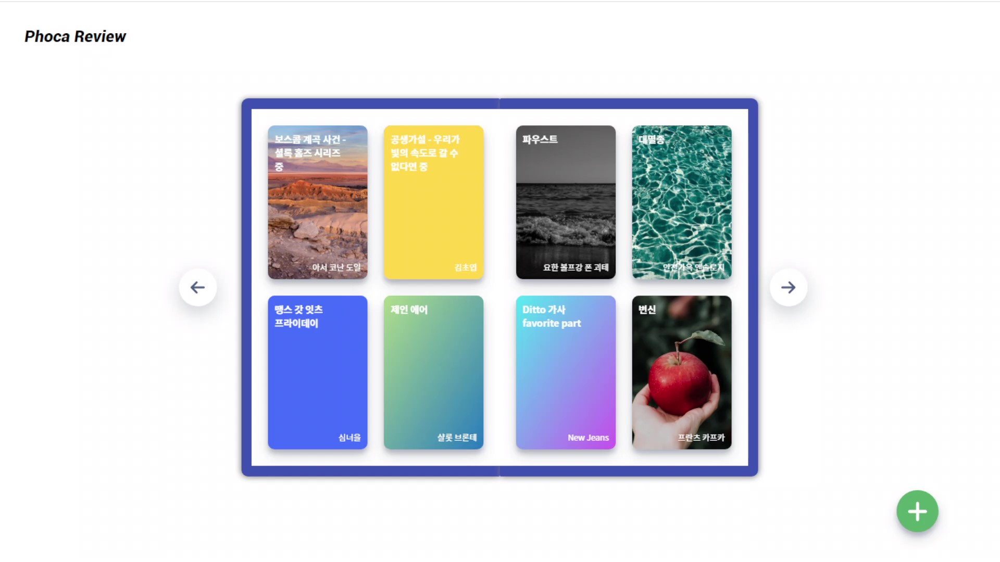
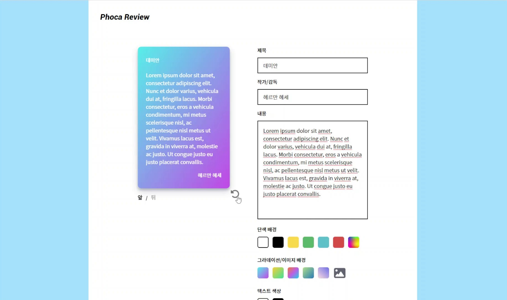
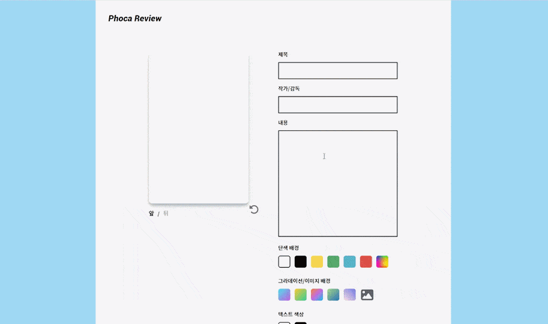
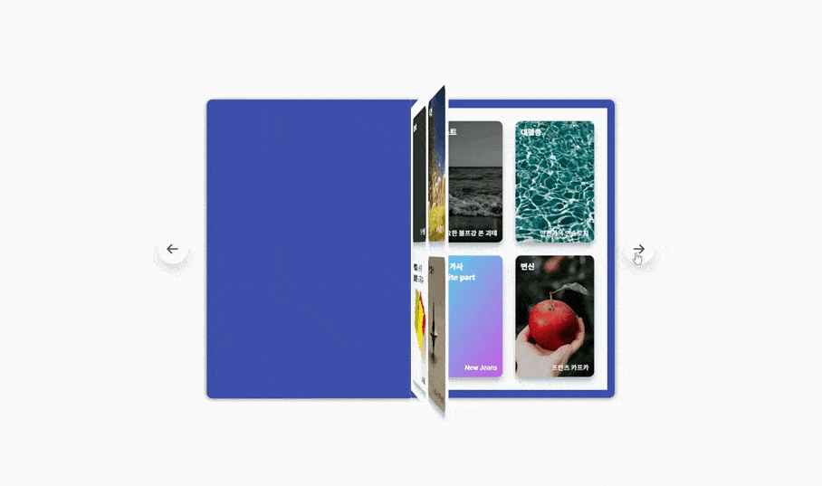
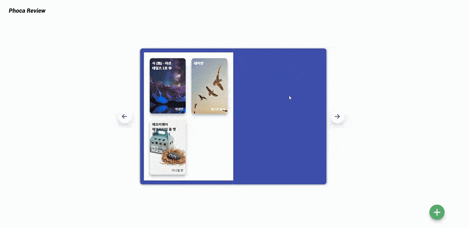
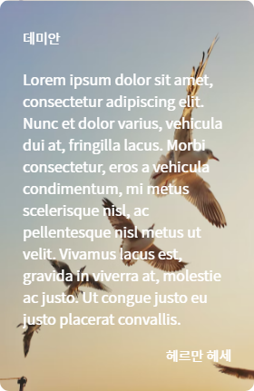
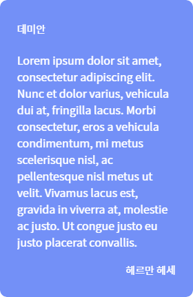

# phoca-review

## Phoca-Review 서비스란?

### 책이나 영화에 대한 감상문을 포토카드 형태로 남길 수 있는 웹 어플리케이션.

- 감상문을 쓰고 싶은데 길게 써야 한다는 부담감을 느껴보신 적이 있으신가요?  
  메모하듯이 카드 한 장에 간단한 감상을 작성해보세요.

- 에디터로 나만의 감상문 포토카드를 만들 수 있습니다. 원하는 대로 색을 넣거나 이미지를 넣어 커스텀해보세요.

- 메인 화면에서는 앨범 형태로 그동안 만든 카드들을 모아볼 수 있습니다. 수집의 재미를 통해 감상문을 작성하는 동기를 향상해 보세요.  
  카드를 뒤집고 앨범을 넘기는 애니메이션을 통해 실제 사물의 물성을 조금이나마 느낄 수도 있답니다.

- 만든 포토카드를 이미지로 다운받는 것도 가능합니다. 다운받은 카드 형태의 이미지를 SNS에 올려 공유해보세요.

### 사용된 툴

> **Frontend** - `React`, `Typescript`, `Emotion`, `HTML2CANVAS` (이미지 컨버팅 Library)  
> **Backend** - `Express`, `multer`, `ajv` (JSON validator library)

 

## 프로젝트 회고글

[블로그 글 보러가기](https://bluepebble25.tistory.com/46)

 

## 실행 영상

  
<b>메인 화면</b>

  
<b>카드 에디터</b>

  
<b>카드 상세보기 / 수정화면</b>

  
<b>카드 삭제 / 다운</b>

아래는 다운받은 카드 이미지

(앞면)

(뒷면)

 

## 실행 방법

- 프로젝트를 다운받습니다.
- 프로젝트의 루트에서 `npm start`를 입력하고 브라우저를 열어 `localhost:5000`으로 접속하면 메인 화면이 보입니다.

#### `npm start`

서버 실행. 서버에서는 API와 build된 클라이언트를 서비스한다.  
그래서 개발하지 않고 단순히 웹사이트를 실행할 목적일 때에는 서버만 실행해도 된다.

#### `cd client > npm start` (클라이언트 실행)

클라이언트 개발을 위한 명령어. `localhost:3000`으로 접속한다.  
수정한 결과물이 `localhost:5000`으로 접속했을 때 반영되게 하려면 client 폴더로 들어가 `npm run build`를 실행한다.

 

## 함께보기

- [Figma 화면 설계 및 디자인](https://www.figma.com/file/8QiLtO5x6wZ0Ele3xWJLvV/%EC%99%80%EC%9D%B4%EC%96%B4%ED%94%84%EB%A0%88%EC%9E%84?node-id=0%3A1&t=v1voCvIyK7nDPvLq-1)
- [Server API 문서](./API_document.md)
